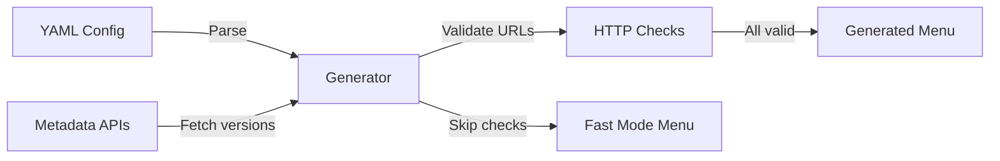

# iPXE Network Boot Menu Generator

**Automated, validated, version-aware iPXE menu generation from simple YAML configuration.**

---

## What is this?

iPXE Menu Generator transforms a simple YAML configuration file into production-ready iPXE boot menus. It automatically fetches the latest distribution versions, validates that boot files exist, and generates menus that just work.

## Why does this exist?

Managing iPXE menus manually is painful:

- **Version drift**: Your menu says "Fedora 39" but Fedora 41 released months ago
- **Broken URLs**: That kernel you linked to? Moved or deleted, and you won't know until someone tries to boot
- **Copy-paste errors**: Adding a new distro means copying 20 lines and hoping you changed all the right fields
- **Testing overhead**: Manually checking each URL takes forever, so you skip it

iPXE Menu Generator solves this by making menu generation:
- **Automatic** - Fetches latest versions from official metadata
- **Validated** - Verifies every URL before adding to menu
- **Repeatable** - Same config always produces working menus
- **Extensible** - Plugin system for adding new distributions

## Who is this for?

### Homelab enthusiasts
Run a single command and get an up-to-date boot menu with the latest distro versions. No more hunting for kernel URLs.

### System administrators
Generate consistent boot menus across environments. Configuration-as-code means you can version control, review changes, and automate deployments.

### Infrastructure teams
Integrate into CI/CD pipelines. Test menu changes before deployment. Extend with custom distributions for your internal OS images.

## What makes this different?

### Traditional iPXE menus
```ipxe
# Manually maintained, hope it works
:fedora
kernel http://download.fedoraproject.org/pub/fedora/linux/releases/39/Server/x86_64/os/images/pxeboot/vmlinuz
initrd http://download.fedoraproject.org/pub/fedora/linux/releases/39/Server/x86_64/os/images/pxeboot/initrd.img
boot
```

**Problems:**
- Version hardcoded (39 might be outdated)
- No validation (URL might be broken)
- No reusability (copy-paste for each distro)

### With iPXE Menu Generator
```yaml
distributions:
  fedora:
    enabled: true
    type: "dynamic"
    metadata_provider: "fedora"
    metadata_url: "https://fedoraproject.org/releases.json"
    url_template: "http://download.fedoraproject.org/.../releases/{version}/..."
    boot_files:
      kernel: "images/pxeboot/vmlinuz"
      initrd: "images/pxeboot/initrd.img"
```

**Benefits:**
- Automatically detects latest version (e.g., 41)
- Validates kernel and initrd URLs exist
- One config block = infinite menus
- Track changes in git

## How does it work?



1. **Define** - Write a YAML config describing your distributions
2. **Fetch** - Generator queries metadata providers for latest versions
3. **Validate** - HTTP HEAD requests verify all boot files exist
4. **Generate** - Jinja2 templates produce iPXE menu files

## Key Features

### 🔄 Dynamic Version Detection
Never hardcode versions again. Fedora, Debian, and other metadata providers automatically supply the latest stable versions.

### ✅ URL Validation
Every kernel, initrd, and boot file is checked before being added to your menu. Catch broken mirrors before your users do.

### 🎯 Modular Architecture
Plugin system makes adding new distributions straightforward. Write one Python class, register it, done.

### 🚀 Fast Mode
Skip validation when iterating on menu layout. Re-validate when you're ready to deploy.

### 📝 Custom Templates
Jinja2 templates mean full control over menu appearance and behavior. Override defaults or build entirely custom layouts.

### 🏗️ Modern Tooling
Built with Hatch for reproducible environments. Full test suite. Markdown-linted documentation. Type hints throughout.

## Getting Started

Ready to automate your boot menu? See the [Getting Started Guide](getting-started.md) for a complete walkthrough.

Or jump straight to the [Reference](reference.md) for command and configuration details.

## FAQ

### Does this replace iPXE?
No. This generates iPXE menu files. You still need an iPXE server to serve them.

### What distributions are supported?
Currently: Fedora (dynamic versions), plus static configs for Debian, CentOS, netboot.xyz. Adding new ones takes ~50 lines of Python.

### Can I use this in production?
Yes. URL validation ensures menus work before deployment. Many users run this in homelabs and small datacenters.

### Does it work with UEFI?
Yes, iPXE menus work with both BIOS and UEFI. This tool is menu-generation only—your iPXE server setup determines boot mode.

### Can I add my own custom OS images?
Absolutely. Static distributions support arbitrary URLs. For internal images, add them as static entries in your config.

### How do I contribute?
See the [Contributing Guide](developer/contributing.md) for development setup, testing, and how to add new distribution plugins.

---

## Links

- **[Getting Started](getting-started.md)** - Complete walkthrough with examples
- **[Reference](reference.md)** - Commands and configuration reference
- **[Architecture](developer/architecture.md)** - Technical design and plugin system
