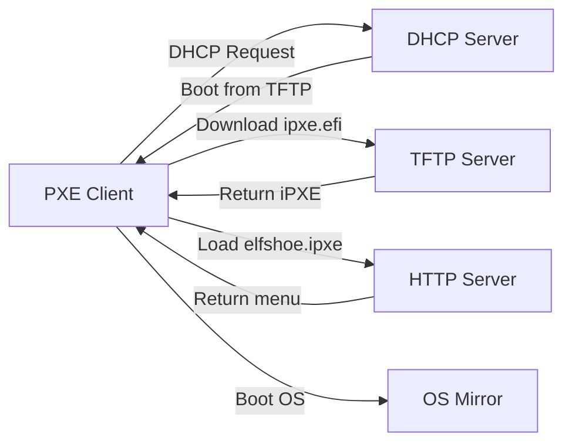

# Server Setup Guide

This guide covers setting up the complete network boot infrastructure needed to use elfshoe-generated menus.

## Overview

Network booting with iPXE requires three components:

1. **DHCP Server** - Directs clients to the TFTP server and boot files
2. **TFTP Server** - Serves iPXE boot loaders (ipxe.pxe, ipxe.efi)
3. **HTTP Server** - Serves your elfshoe-generated menu and OS installation files



## Getting iPXE Boot Files

### Official iPXE Downloads

Download pre-built iPXE binaries from the official iPXE project:

- **Website**: [https://ipxe.org/download](https://ipxe.org/download)
- **Direct downloads**: [https://boot.ipxe.org/](https://boot.ipxe.org/)

**Required files:**

```bash
# For BIOS/Legacy systems
wget https://boot.ipxe.org/ipxe.pxe -O /tftpboot/ipxe.pxe

# For UEFI x86_64 systems (most common)
wget https://boot.ipxe.org/x86_64-efi/ipxe.efi -O /tftpboot/ipxe.efi

# For UEFI ARM64 systems
wget https://boot.ipxe.org/arm64-efi/ipxe.efi -O /tftpboot/ipxe-arm64.efi

# Other architectures available at https://boot.ipxe.org/
# - arm32-efi/ipxe.efi
# - i386-efi/ipxe.efi
# - riscv64-efi/ipxe.efi
# - loong64-efi/ipxe.efi
```

**Note:** The root-level `https://boot.ipxe.org/ipxe.efi` does not exist. Use the architecture-specific paths above.

### Building iPXE from Source

For custom configurations or embedded scripts, build from source:

```bash
# Clone iPXE repository
git clone https://github.com/ipxe/ipxe.git
cd ipxe/src

# Build BIOS version
make bin/ipxe.pxe

# Build UEFI version
make bin-x86_64-efi/ipxe.efi

# Copy to TFTP directory
cp bin/ipxe.pxe /tftpboot/
cp bin-x86_64-efi/ipxe.efi /tftpboot/
```

**Documentation**: [https://ipxe.org/download](https://ipxe.org/download)

## DHCP Server Configuration

### Option 1: dnsmasq (Recommended for Simple Setups)

dnsmasq combines DHCP and TFTP in one lightweight daemon.

**Install:**

```bash
# Debian/Ubuntu
sudo apt install dnsmasq

# RHEL/CentOS/Fedora
sudo dnf install dnsmasq
```

**Configuration** (`/etc/dnsmasq.d/pxe-boot.conf`):

```ini
--8<-- "docs/examples/99-dnsmasq-pxe-ipxe.conf"
```

**Notes:**

- Adjust `tftp-root=/tftpboot` to your TFTP directory
- `elfshoe.ipxe` must be a file in the TFTP root (DHCP boot filename option only supports TFTP)
- For HTTP delivery, use Option 2 below (chain loader approach)
- Supports both BIOS and UEFI clients automatically

**Restart:**

```bash
sudo systemctl restart dnsmasq
sudo systemctl enable dnsmasq
```

### Option 2: ISC DHCP Server

For environments already using ISC DHCP.

**Install:**

```bash
# Debian/Ubuntu
sudo apt install isc-dhcp-server

# RHEL/CentOS/Fedora
sudo dnf install dhcp-server
```

**Configuration** (`/etc/dhcp/dhcpd.conf`):

```dhcpd
# Detect client architecture
option architecture-type code 93 = unsigned integer 16;

subnet 192.168.1.0 netmask 255.255.255.0 {
    range 192.168.1.100 192.168.1.200;
    option routers 192.168.1.1;
    option domain-name-servers 8.8.8.8, 8.8.4.4;

    # TFTP server address
    next-server 192.168.1.10;

    # Architecture-specific boot files
    if option architecture-type = 00:00 {
        # BIOS
        filename "ipxe.pxe";
    } elsif option architecture-type = 00:07 {
        # UEFI x86_64
        filename "ipxe.efi";
    } elsif option architecture-type = 00:09 {
        # UEFI x86_64 (alternative)
        filename "ipxe.efi";
    } elsif option architecture-type = 00:0b {
        # UEFI ARM64
        filename "ipxe-arm64.efi";
    }
}
```

**Restart:**

```bash
sudo systemctl restart isc-dhcp-server
sudo systemctl enable isc-dhcp-server
```

### Option 3: Windows DHCP Server

For Windows Server environments.

1. Open DHCP Management Console
2. Right-click your scope → **Scope Options**
3. Configure:
   - **Option 66** (Boot Server Host Name): `192.168.1.10` (your TFTP server IP)
   - **Option 67** (Boot File Name): `ipxe.efi` (or `ipxe.pxe` for BIOS)

**For mixed BIOS/UEFI environments**, use DHCP policies:

1. Right-click scope → **Policies** → **New Policy**
2. Name: "UEFI Clients"
3. Conditions: Client identifier → Match → `00:07` (UEFI x86_64)
4. Set Option 67: `ipxe.efi`
5. Create another policy for BIOS clients (condition: `00:00`)

## TFTP Server Setup

### Option 1: dnsmasq TFTP (Already Configured Above)

If using dnsmasq for DHCP, TFTP is already enabled.

### Option 2: tftpd-hpa (Standalone TFTP)

**Install:**

```bash
# Debian/Ubuntu
sudo apt install tftpd-hpa

# RHEL/CentOS/Fedora
sudo dnf install tftp-server
```

**Configure** (`/etc/default/tftpd-hpa`):

```bash
TFTP_USERNAME="tftp"
TFTP_DIRECTORY="/tftpboot"
TFTP_ADDRESS="0.0.0.0:69"
TFTP_OPTIONS="--secure"
```

**Setup directory:**

```bash
sudo mkdir -p /tftpboot
sudo chown -R tftp:tftp /tftpboot
sudo chmod 755 /tftpboot
```

**Start:**

```bash
sudo systemctl restart tftpd-hpa
sudo systemctl enable tftpd-hpa
```

### Option 3: Windows TFTP

Use a third-party TFTP server like:

- **Tftpd64** - [https://pjo2.github.io/tftpd64/](https://pjo2.github.io/tftpd64/)
- **SolarWinds TFTP Server**

## HTTP Server Setup

Your elfshoe-generated `elfshoe.ipxe` should be served via HTTP (not TFTP) for better performance.

### Option 1: nginx

**Install:**

```bash
# Debian/Ubuntu
sudo apt install nginx

# RHEL/CentOS/Fedora
sudo dnf install nginx
```

**Configure** (`/etc/nginx/sites-available/pxe-boot`):

```nginx
server {
    listen 80;
    server_name pxe.example.com;

    root /var/www/pxe;

    location / {
        autoindex on;
        add_header Cache-Control "no-cache, must-revalidate";
    }

    # Serve elfshoe-generated menu
    location /elfshoe.ipxe {
        default_type text/plain;
    }
}
```

**Deploy menu:**

```bash
sudo mkdir -p /var/www/pxe
sudo cp elfshoe.ipxe /var/www/pxe/
sudo systemctl reload nginx
```

### Option 2: Apache

**Configure** (`/etc/apache2/sites-available/pxe-boot.conf`):

```apache
<VirtualHost *:80>
    ServerName pxe.example.com
    DocumentRoot /var/www/pxe

    <Directory /var/www/pxe>
        Options +Indexes
        Require all granted
        Header set Cache-Control "no-cache, must-revalidate"
    </Directory>
</VirtualHost>
```

### Option 3: Simple Python HTTP Server (Development Only)

```bash
cd /path/to/menu/files
python3 -m http.server 80
```

**Note:** Not suitable for production use.

## iPXE Chain Loading

### Option 1: Direct TFTP (Simplest, but Slower)

Place `elfshoe.ipxe` in your TFTP root and configure dnsmasq to serve it directly:

```ini
# In dnsmasq config
dhcp-boot=tag:ipxe,elfshoe.ipxe
```

**Pros:** Simple configuration
**Cons:** TFTP is slow and unreliable for large files; limited to ~32MB file size

**Best for:** Testing and small deployments

### Option 2: HTTP Chain Loading (Recommended for Most Users)

**This is the recommended approach** - fast, reliable, and easy to set up.

Create a tiny chain loader in TFTP that fetches your menu via HTTP:

**Create `/tftpboot/chain.ipxe`:**

```ipxe
#!ipxe

# Chain to elfshoe menu via HTTP (faster, more reliable than TFTP)
chain http://192.168.1.10/elfshoe.ipxe || shell
```

**Configure dnsmasq:**

```ini
dhcp-boot=tag:ipxe,chain.ipxe
```

**Pros:** Fast HTTP delivery, small TFTP file, easy to update menu without touching TFTP
**Cons:** Requires maintaining a small chain loader file

**Best for:** Most production deployments

### Option 3: Embedded Script (Best for Production)

**This is the best approach for production deployments** - no separate chain loader file needed.

Embed the chain command directly into the iPXE bootloader when building from source:

```bash
# Create embed script
echo "#!ipxe" > embed.ipxe
echo "chain http://192.168.1.10/elfshoe.ipxe" >> embed.ipxe

# Build iPXE with embedded script
cd ipxe/src
make bin-x86_64-efi/ipxe.efi EMBED=embed.ipxe
```

This eliminates the need for a separate chain loader file.

```ipxe
#!ipxe

# Set variables
set server http://192.168.1.10

# Chain to elfshoe-generated menu
chain ${server}/elfshoe.ipxe || shell
```

## Firewall Configuration

Open required ports:

```bash
# UFW (Ubuntu/Debian)
sudo ufw allow 67/udp   # DHCP
sudo ufw allow 69/udp   # TFTP
sudo ufw allow 80/tcp   # HTTP

# firewalld (RHEL/CentOS/Fedora)
sudo firewall-cmd --permanent --add-service=dhcp
sudo firewall-cmd --permanent --add-service=tftp
sudo firewall-cmd --permanent --add-service=http
sudo firewall-cmd --reload

# iptables
sudo iptables -A INPUT -p udp --dport 67 -j ACCEPT
sudo iptables -A INPUT -p udp --dport 69 -j ACCEPT
sudo iptables -A INPUT -p tcp --dport 80 -j ACCEPT
```

## Testing Your Setup

### 1. Test TFTP Server

```bash
# From another machine
tftp 192.168.1.10
tftp> get ipxe.efi
tftp> quit

# Verify file was downloaded
ls -lh ipxe.efi
```

### 2. Test HTTP Server

```bash
curl http://192.168.1.10/elfshoe.ipxe
```

Should return your elfshoe-generated menu.

### 3. Test PXE Boot

1. Boot a VM or physical machine with network boot enabled
2. Watch the boot process:
   - Client gets IP from DHCP
   - Downloads `ipxe.efi` or `ipxe.pxe` via TFTP
   - iPXE loads and fetches `elfshoe.ipxe` via HTTP
   - Your elfshoe menu appears

### 4. Debug with iPXE Shell

If boot fails, press Ctrl+B to enter iPXE shell:

```ipxe
# Check network configuration
dhcp
ifstat

# Test TFTP
tftp://192.168.1.10/ipxe.efi

# Test HTTP
http://192.168.1.10/elfshoe.ipxe

# Manual chain
chain http://192.168.1.10/elfshoe.ipxe
```

## Complete Workflow

1. **Setup infrastructure:**
   - Install DHCP + TFTP (dnsmasq or separate)
   - Install HTTP server (nginx/apache)
   - Download iPXE boot files

2. **Generate menu with elfshoe:**

   ```bash
   elfshoe -c config.yaml -o elfshoe.ipxe
   ```

3. **Deploy menu:**

   ```bash
   sudo cp elfshoe.ipxe /var/www/pxe/
   ```

4. **Boot clients:**
   - Enable network boot in BIOS/UEFI
   - Boot and select your OS

## Security Considerations

### Production Checklist

- [ ] Use HTTPS for menu delivery (requires iPXE with HTTPS support)
- [ ] Implement network segmentation for PXE traffic
- [ ] Restrict TFTP/HTTP access to boot VLAN only
- [ ] Use read-only TFTP directory permissions
- [ ] Enable DHCP snooping on managed switches
- [ ] Verify integrity of iPXE boot files (checksums)
- [ ] Monitor DHCP/TFTP logs for anomalies

### HTTPS Setup (Optional)

Build iPXE with HTTPS support:

```bash
cd ipxe/src
make bin-x86_64-efi/ipxe.efi EMBED=script.ipxe TRUST=/path/to/ca-cert.crt
```

Then configure nginx with SSL for serving `elfshoe.ipxe`.

## Troubleshooting

### Client gets IP but doesn't boot

- Check DHCP next-server and filename options
- Verify TFTP server is running: `sudo systemctl status tftpd-hpa`
- Check firewall allows UDP port 69

### Client boots iPXE but no menu appears

- Verify HTTP server is accessible from client network
- Check `/var/www/pxe/elfshoe.ipxe` exists and is readable
- Test with `curl http://server-ip/elfshoe.ipxe`

### Mixed BIOS/UEFI environment issues

- Ensure DHCP serves correct boot file per architecture
- BIOS needs `ipxe.pxe`, UEFI needs `ipxe.efi`
- Check client architecture detection in DHCP logs

## References

- **iPXE Project**: [https://ipxe.org/](https://ipxe.org/)
- **iPXE Documentation**: [https://ipxe.org/docs](https://ipxe.org/docs)
- **iPXE Downloads**: [https://boot.ipxe.org/](https://boot.ipxe.org/)
- **iPXE Scripting**: [https://ipxe.org/scripting](https://ipxe.org/scripting)
- **dnsmasq Documentation**: [http://www.thekelleys.org.uk/dnsmasq/doc.html](http://www.thekelleys.org.uk/dnsmasq/doc.html)

## Related Documentation

- [Getting Started](getting-started.md) - Using elfshoe to generate menus
- [Reference](reference.md) - elfshoe command and configuration reference
